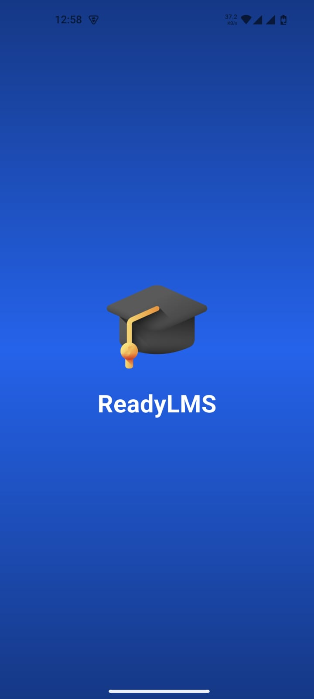
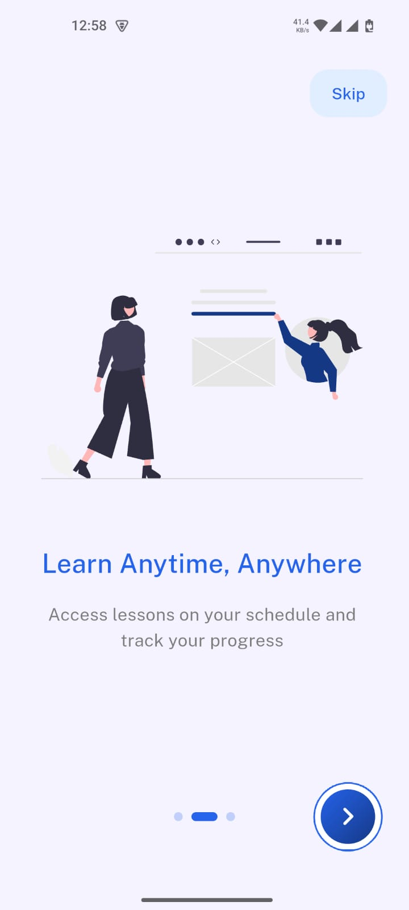
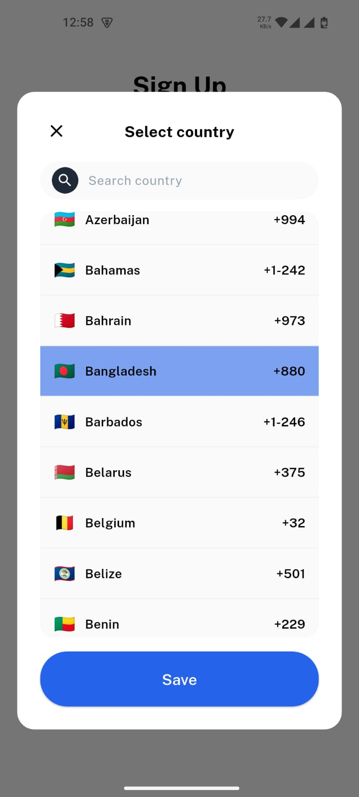
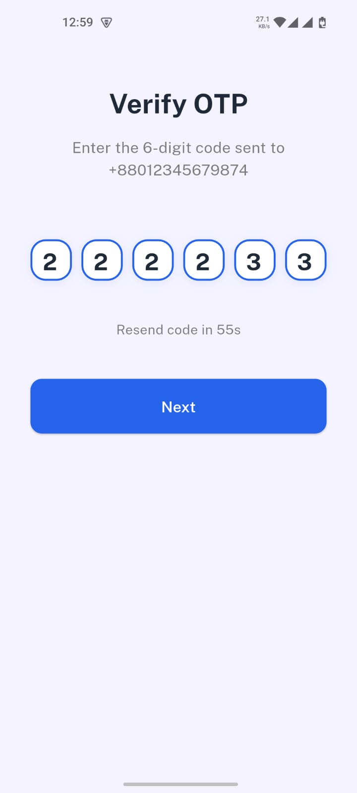
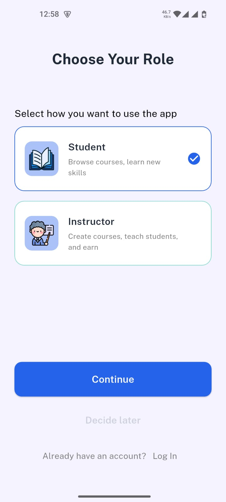
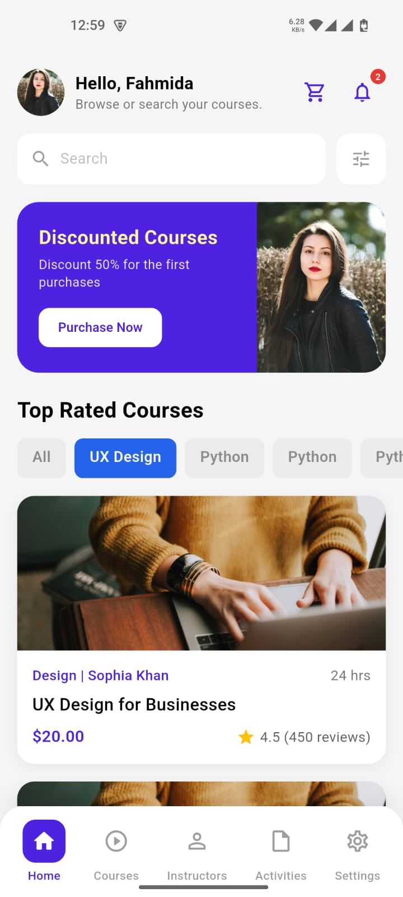

# ReadyLMS - Job Task

## 🎯 Project Overview

**ReadyLMS** is a modern e-learning platform built with Flutter that provides:
- Onboarding experience for first-time users
- User authentication (signup/login with OTP verification)
- Role-based access (Student/Instructor selection)
- Course discovery with filtering and search
- Interactive course cards and recommendations
- Persistent user data and preferences using Hive local storage

**Target Platforms:** Android, iOS, Web
**State Management:** Riverpod (StateNotifier)
**Local Storage:** Hive Key-Value Database

---

## ✨ Key Features

| Feature | Status | Description |
|---------|--------|-------------|
| **Onboarding Screens** | ✅ Complete | First-time user flow with skip option |
| **Authentication** | ✅ Complete | Email/Phone signup, OTP verification |
| **Role Selection** | ✅ Complete | Student/Instructor role picker |
| **Home Screen** | ✅ Complete | Personalized greeting, course recommendations |
| **Course Discovery** | ✅ Complete | Browse, filter, and search courses |
| **Interactive Chips** | ✅ Complete | Category selection with visual feedback |
| **Persistent Storage** | ✅ Complete | Hive-based user data persistence |
| **Bottom Navigation** | ✅ Complete | Multi-tab navigation |

---

## � App Screenshots & Demo

### Screenshots
Below are key screens from the ReadyLMS application:

<div style="display: grid; grid-template-columns: repeat(3, 1fr); gap: 20px; margin: 20px 0;">
  <div style="text-align: center;">
    
    <p><strong>Splash Screen</strong><br/>App launch with ReadyLMS branding</p>
  </div>
  
  <div style="text-align: center;">
    
    <p><strong>Onboarding</strong><br/>Learn Anytime, Anywhere carousel</p>
  </div>
  
  <div style="text-align: center;">
    
    <p><strong>Country Selection</strong><br/>Phone picker dialog during signup</p>
  </div>
</div>


  
  <div style="text-align: center;">
    
    <p><strong>OTP Verification</strong><br/>6-digit code verification screen</p>
  </div>
  
  <div style="text-align: center;">
    
    <p><strong>Role Selection</strong><br/>Choose Student or Instructor</p>
  </div>
</div>

<div style="display: grid; grid-template-columns: repeat(3, 1fr); gap: 20px; margin: 20px 0;">
  <div style="text-align: center;">
    
    <p><strong>Home Screen</strong><br/>Main dashboard with courses</p>
  </div>
  
 
</div>
### Demo Flow

The app flow follows this main journey:

<div style="background: #f5f5f5; padding: 20px; border-radius: 8px; margin: 20px 0;">

```
┌─────────────────────────────────────────────────────────────┐
│                    APP LAUNCH (main.dart)                   │
│              Initialize Hive & WidgetsBinding                │
└────────────────────────┬────────────────────────────────────┘
                         │
                         ▼
┌─────────────────────────────────────────────────────────────┐
│              SPLASH SCREEN (2 seconds)                       │
│         Check: HiveService.hasSeenOnboarding()              │
└────────────────────────┬────────────────────────────────────┘
                         │
         ┌───────────────┴───────────────┐
         │                               │
    FALSE(New)                      TRUE(Returning)
         │                               │
         ▼                               ▼
┌─────────────────────────┐     ┌──────────────────────────┐
│  ONBOARDING (3 pages)   │     │  WELCOME SCREEN          │
│  - Skip button          │     │  - Sign In / Sign Up     │
│  - Next arrow           │     │  - Social auth options   │
│  - Set Hive flag        │     └────────┬─────────────────┘
└──────────┬──────────────┘              │
           │                             │
           ▼                             ▼
    ┌──────────────┐            ┌──────────────────┐
    │ ROLE SELECT  │            │ AUTHENTICATION   │
    │ Student/     │            │ Email/Phone+OTP  │
    │ Instructor   │            └────────┬─────────┘
    └──────┬───────┘                     │
           │                             │
           └─────────────┬───────────────┘
                         │
                         ▼
            ┌──────────────────────────┐
            │   ROLE SELECTION         │
            │   Student or Instructor  │
            └────────────┬─────────────┘
                         │
                         ▼
       ┌─────────────────────────────────┐
       │     HOME SCREEN (Main App)      │
       │  ✓ Dynamic greeting with name   │
       │  ✓ Course discovery             │
       │  ✓ Interactive filters          │
       │  ✓ Bottom navigation            │
       └─────────────────────────────────┘
```

</div>

### Video Demo

<div style="margin: 30px 0; text-align: center;">
  <h4>📹 Complete App Demo - Full Feature Walkthrough</h4>
  <p style="color: #666; margin: 15px 0;">
    Watch the complete user journey from app launch through onboarding, authentication, role selection, and home screen with interactive features.
  </p>
  
  **Stream:**
  - [Download MP4](screenshots/video.mp4) - Local playback
  
  **Demo Covers:**
  - ✅ Splash screen (2-second launch)
  - ✅ Onboarding flow (3-page carousel)
  - ✅ Signup with country selection
  - ✅ OTP verification flow
  - ✅ Role selection (Student/Instructor)
  - ✅ Home screen with dynamic greeting
  - ✅ Course discovery & filtering
  - ✅ Hive persistence (name storage across restarts)
  - ✅ Interactive chips and navigation
</div>

---

## �📦 Tech Stack & Packages

### Core Framework
- **Flutter** 3.11.1+
- **Dart** 3.11.1

### State Management
- **flutter_riverpod** ^2.4.0 - Reactive state management
  - NotifierProvider for signup/auth state
  - StateNotifier for controller logic

### UI & Responsive Design
- **flutter_screenutil** ^5.9.0 - Responsive sizing (`.w`, `.h`, `.sp`, `.r`)
- **flutter_svg** ^2.0.7 - SVG asset rendering
- **carousel_slider** ^4.2.1 - Image carousel in promo sections
- **smooth_page_indicator** ^1.1.0 - Onboarding page dots

### Local Storage & Persistence
- **hive_flutter** ^1.1.0 - Local key-value storage
- **hive** ^2.2.3 - Core Hive database

### Routing & Navigation
- **go_router** ^12.1.0 - Declarative routing with GoRouter

### Utilities
- **intl** ^0.18.1 - Internationalization & formatting
- **country_picker** ^3.0.0+ - Country selection dialog

---

## 📁 Project Structure

```
readylms_jobtask/
├── lib/
│   ├── main.dart                          # App entry point with Hive initialization
│   │
│   ├── core/                              # Shared utilities & configurations
│   │   ├── local_storage/
│   │   │   └── hive_service.dart         # Hive wrapper for persistence
│   │   ├── routes/
│   │   │   └── app_router.dart           # GoRouter configuration
│   │   ├── utils/
│   │   │   └── validators.dart           # Form validators
│   │   ├── values/
│   │   │   ├── colors.dart               # Color constants
│   │   │   ├── app_fonts.dart            # Typography styles
│   │   │   └── app_icons.dart            # Icon constants
│   │   └── widgets/                       # Reusable UI components
│   │       ├── bottom_nav/
│   │       │   └── bottom_nav_bar.dart
│   │       ├── custom_text_field.dart
│   │       ├── custom_button_widget.dart
│   │       └── country_picker_dialog.dart
│   │
│   ├── features/
│   │   ├── onboarding/                   # First-time user flow
│   │   │   ├── view/
│   │   │   │   ├── splash_screen.dart    # 2-sec splash with Hive check
│   │   │   │   └── onboarding_screen.dart # 3-page onboarding carousel
│   │   │   └── viewmodel/
│   │   │       └── onboarding_provider.dart # Onboarding state
│   │   │
│   │   ├── auth/                         # Authentication flows
│   │   │   ├── view/
│   │   │   │   ├── welcome_screen.dart   # Sign in / Sign up entry
│   │   │   │   ├── login_screen.dart     # Email/Phone login
│   │   │   │   ├── signup_screen.dart    # Registration form
│   │   │   │   ├── verify_otp_screen.dart # OTP verification
│   │   │   │   └── verification_success_screen.dart
│   │   │   └── viewmodel/
│   │   │       ├── login_provider.dart
│   │   │       ├── signup_provider.dart   # Signup state + Hive name save
│   │   │       └── otp_provider.dart     # OTP verification state
│   │   │
│   │   ├── role/                         # Role selection
│   │   │   ├── view/
│   │   │   │   └── role_screen.dart
│   │   │   └── viewmodel/
│   │   │       └── role_provider.dart
│   │   │
│   │   └── home/                         # Main app screen
│   │       ├── view/
│   │       │   └── home_screen.dart      # Dashboard + dynamic greeting
│   │       └── widgets/
│   │           ├── course_card.dart      # Course UI component
│   │           └── filter_modal.dart     # Filter bottom sheet
│   │
│   └── assets/
│       ├── icons/                        # SVG icons
│       └── images/                       # PNG/JPG images
│
├── android/                               # Android native code
├── ios/                                  # iOS native code
│
└── pubspec.yaml                          # Dependencies & assets config
```

---

## 🧪 Testing Guide

### Test Scenarios & Sample Data

#### **1. Onboarding Flow (First-Time User)**

**Steps:**
1. Uninstall and reinstall app (or clear app data)
2. App launches → Splash screen (2 seconds)
3. Splash checks `HiveService.hasSeenOnboarding()` → **false**
4. Redirects to `/onboarding` screen

**Expected Behavior:**
- See 3 onboarding pages with "Skip" button
- Swipe through pages or click next arrow
- On last page: Click next arrow → `HiveService.setOnboardingSeen()` called
- Redirects to `/role` screen

**Verification:**
- Open app again → Splash immediately goes to `/welcome` (onboarding skipped)

---

#### **2. Signup & Name Persistence**

**Test Data:**
```
Full Name:    Fahmida Ahmed
Email:        fahmida@example.com
Country:      +880 (Bangladesh)
Phone:        1612345678
Password:     Password@123
Terms:        ✓ Checked
```

**Steps:**
1. From welcome screen → Click "Sign Up"
2. Fill signup form with data above
3. Click "Sign up" button
4. Wait 2 seconds (simulated API call)
5. Redirects to `/verify-otp` screen

**Behind the Scenes:**
- `signUpProvider.signUp()` called
- Function extracts name: `"Fahmida Ahmed"`
- Calls `await HiveService.setUserName("Fahmida Ahmed")`
- Data persisted to Hive box `user_box` with key `user_name`

**Verification:**
- Complete OTP flow
- Navigate to `/home` screen
- Greeting text shows: **"Hello, Fahmida Ahmed"** (instead of hardcoded "Fahmida")
- Close and reopen app → Name persists

---

#### **3. OTP Verification**

**Steps:**
1. From signup flow, you're on `/verify-otp`
2. Any numeric input accepted (simulated OTP)
3. Example: Enter `123456`
4. Click "Verify" button
5. Wait 2 seconds
6. Success message displayed

**Test Data:**
```
OTP Code:  123456 (any 6 digits accepted)
```

---

#### **4. Login Flow**

**Test Data:**
```
Email/Phone:   fahmida@example.com  (from signup)
Password:      Password@123        (from signup)
```

**Steps:**
1. From welcome screen → Click "Log In"
2. Enter email
3. Enter password
4. Click "Log in" button
5. Wait 2 seconds
6. Redirects to `/verify-otp`
7. Complete OTP flow

---

#### **5. Role Selection**

**Steps:**
1. After OTP verification success
2. Redirects to `/role` screen
3. Choose **Student** or **Instructor** role
4. Click corresponding card/button
5. Redirects to `/home`

**Test Data:**
```
Role Options:
- Student   (Learn courses)
- Instructor (Create courses)
```

---

#### **6. Home Screen - Interactive Features**

**Test Data:**
```
Top Rated Courses Chips:
- Python (default)
- UX Design
- Mobile Dev
- Web Dev

Free Courses Chips:
- All (default)
- Design
- Development
- Business
```

**Steps:**
1. On home screen, locate chip rows
2. Click "UX Design" chip in Top Rated section
3. Chip changes color (purple → light purple highlight)
4. Click another chip to change selection

**Expected Behavior:**
- Chip color updates to show selection state
- Only one chip selected per section at a time
- Visual feedback on tap

---

#### **7. Filter Modal**

**Steps:**
1. On home screen, scroll to "Top Rated Courses"
2. Click gray filter icon in search area
3. Bottom sheet slides up with filter options
4. Apply filters (category, price range, rating)
5. Close to see filtered results

---

### Test Checklist

- [ ] First app launch shows onboarding (Hive: `has_seen_onboarding` = false)
- [ ] Close and reopen app → Onboarding skipped (Hive: `has_seen_onboarding` = true)
- [ ] Signup with name → Greeting displays name on home screen
- [ ] Close app → Reopen → Name persists on home screen
- [ ] Interactive chips change color on tap
- [ ] Home screen greeting shows stored user name (not hardcoded "Fahmida")
- [ ] Filter modal opens/closes smoothly
- [ ] Navigation flow: Splash → Onboarding → Role → Home (first time)
- [ ] Navigation flow: Splash → Welcome → Login → OTP → Home (returning user)
- [ ] No analyzer errors: `flutter analyze`

---

### Data Flow in ReadyLMS

#### **Scenario 1: First-Time User (Onboarding)**

```
1. App Launch
   ↓
2. main.dart: HiveService.initialize()
   → Opens 'user_box' box
   ↓
3. Splash Screen (2 sec delay)
   → Calls HiveService.hasSeenOnboarding()
   → Hive returns false (key doesn't exist yet)
   ↓
4. Route: context.go('/onboarding')
   → User sees onboarding screens
   ↓
5. User completes onboarding (last page)
   → Calls HiveService.setOnboardingSeen()
   → Hive saves: _userBox['has_seen_onboarding'] = true
   ↓
6. Route: context.go('/role')
   → User selects Student/Instructor
   ↓
7. Close and reopen app
   → Splash screen: HiveService.hasSeenOnboarding() returns true
   → Route: context.go('/welcome')  (skip onboarding)
```

---

#### **Scenario 2: User Registration & Name Storage**

```
1. SignUp Screen
   → User enters: Name = "Fahmida Ahmed"
   ↓
2. Click "Sign up" button
   → signUpProvider.signUp() called
   ↓
3. In signUp() method:
   a) Validate form
   b) Simulate API delay (2 sec)
   c) Extract name: final name = nameController.text
   d) Call: await HiveService.setUserName(name)
      → Hive saves: _userBox['user_name'] = "Fahmida Ahmed"
   ↓
4. Redirect to OTP verification
   ↓
5. After OTP verification → Navigate to home screen
   ↓
6. Home Screen Greeting:
   → Calls: HiveService.getUserName()
   → Hive returns: "Fahmida Ahmed"
   → Text shows: "Hello, Fahmida Ahmed"
   ↓
7. Close and reopen app
   → Home screen: Name still displays (persisted in Hive)
```

---

### Hive Box Structure

```
Box Name: 'user_box'
├── Key: 'has_seen_onboarding'
│   └── Value: true/false (type: bool)
│
└── Key: 'user_name'
    └── Value: "Fahmida Ahmed" (type: String)
```


## 🔧 Development Tips

### Running the App

```bash
# Get dependencies
flutter pub get

# Run on Android/iOS
flutter run

# Run with verbose logging
flutter run -v

# Generate release build
flutter build apk  # Android
flutter build ios  # iOS
```


### Analyzer Check

```bash
flutter analyze
```

---


